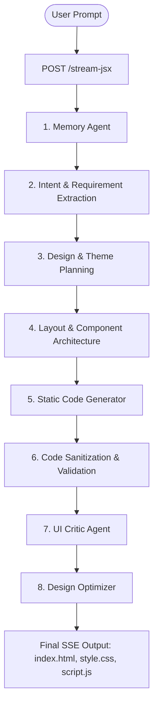

# 🎨 Text-to-Design AI Engine

An autonomous, multi-agent AI system designed to convert natural language prompts into production-ready, responsive static websites (**HTML5**, **CSS3**, and **Vanilla JavaScript**).

---

## 🚀 Key Features

- **🤖 Multi-Agent Orchestration**: Powered by specialized AI agents working together in a phased pipeline (Memory, Intent, Design Planner, Theme Planner, Layout Planner, Code Generator, UI Critic, and Optimizer).
- **🌐 Pure Static Code Generation**: Generates 100% framework-free, zero-dependency code:
  - `index.html`: Semantic HTML5, accessibility meta tags, and structured layout sections.
  - `style.css`: Modern CSS3 using `:root` CSS variables, Flexbox, Grid, keyframe animations, gradients, and glassmorphism.
  - `script.js`: Native Vanilla JS DOM manipulation (mobile menus, smooth scrolling, accordions, tabs, counters, intersection observers).
- **⚡ Real-Time SSE Streaming**: Streams live agent status events, timeline progress, and final code payloads to the frontend over Server-Sent Events.
- **🧠 Personalized User Memory**: Remembers user preferences, preferred typography, color themes, and past successful design choices.
- **🛡️ Automated Quality & Validation**: Built-in static validation, AST syntax checking, and fallback handling to ensure valid HTML/CSS/JS outputs.
- **🔍 Awwwards-Level UI Critic & Optimizer**: Automated hybrid review agent evaluates layout hierarchy, visual contrast, and spacing, triggering an optimization phase if scores fall below threshold.
- **💻 Browser Runtime Engine**: Live browser preview powered by WebContainers for instant rendering and interactive file editing.

---

## 🏗️ System Architecture



---

## 📁 Repository Structure

```
.
├── backend/
│   ├── app/
│   │   ├── agents/            # Multi-Agent definitions (Memory, Critic, Optimizer, Orchestrator)
│   │   ├── api/routes/        # FastAPI route definitions (/stream-jsx, /health, etc.)
│   │   ├── controllers/       # Route controllers & SSE streaming handlers
│   │   ├── core/              # System prompts & model routing configurations
│   │   ├── pipeline/          # Core Pipeline Engine & generation stages
│   │   ├── repositories/      # Vector DB & Memory storage services
│   │   └── utils/             # Code sanitization & syntax validators
│   ├── main.py                # FastAPI main entrypoint
│   └── requirements.txt       # Python dependencies
├── client/                    # Vite + React frontend dashboard & editor
│   ├── src/
│   │   ├── components/        # Frontend workspace UI & WebContainer Live Preview
│   │   └── hooks/             # Custom SSE generation hooks
│   └── package.json           # Client npm configuration
├── Makefile                   # Build & development task runner
├── make.bat                   # Native Windows Batch task wrapper
└── README.md                  # System documentation
```

---

## ⚙️ Core Pipeline Functions

### 1. Orchestration & Pipeline Engine

| Function / Class | Location | Description |
| :--- | :--- | :--- |
| `run_adk_orchestration_stream()` | [adk_orchestrator.py](file:///c:/merged_partition_content/D%20drive/Projects/text%20to%20design%20project/test-to-design3/backend/app/agents/adk/adk_orchestrator.py) | Main multi-agent execution loop. Coordinates timeline events, memory, generation, validation, critic, and final payload. |
| `PipelineEngine.process_prompt()` | [engine.py](file:///c:/merged_partition_content/D%20drive/Projects/text%20to%20design%20project/test-to-design3/backend/app/pipeline/engine.py) | Executes Phases 1–4 (Intent Detection, Design Planning, Layout Architecture, Code Generation). |
| `StaticWebsiteGenerator.process()` | [code_generation.py](file:///c:/merged_partition_content/D%20drive/Projects/text%20to%20design%20project/test-to-design3/backend/app/pipeline/stages/code_generation.py) | Translates design context into `index.html`, `style.css`, and `script.js`. |

### 2. Validation, Sanitization & Repair

| Function / Class | Location | Description |
| :--- | :--- | :--- |
| `dry_run_compile()` | [project_runner.py](file:///c:/merged_partition_content/D%20drive/Projects/text%20to%20design%20project/test-to-design3/backend/project_runner.py) | Runs pre-flight static code validation on proposed files before returning them. |
| `validate_generated_code()` | [jsx_validator.py](file:///c:/merged_partition_content/D%20drive/Projects/text%20to%20design%20project/test-to-design3/backend/app/utils/validators/jsx_validator.py) | Stack-based bracket and HTML structure validator. |
| `run_code_sanitization()` | [sanitizer_agent.py](file:///c:/merged_partition_content/D%20drive/Projects/text%20to%20design%20project/test-to-design3/backend/app/agents/sanitizer_agent.py) | Cleans LLM output artifacts, strips markdown fences, and normalizes line endings. |

### 3. Review & Optimization

| Function / Class | Location | Description |
| :--- | :--- | :--- |
| `run_critic_agent()` | [critic_optimizer_agent.py](file:///c:/merged_partition_content/D%20drive/Projects/text%20to%20design%20project/test-to-design3/backend/app/agents/critic_optimizer_agent.py) | Evaluates generated design against UX benchmarks and scores quality (0–10). |
| `run_optimization_agent()` | [critic_optimizer_agent.py](file:///c:/merged_partition_content/D%20drive/Projects/text%20to%20design%20project/test-to-design3/backend/app/agents/critic_optimizer_agent.py) | Applies visual improvements based on Critic recommendations. |

---

## 🔌 API Endpoints

### `POST /stream-jsx`
Triggers the multi-agent design generation pipeline and streams SSE progress.

**Request Body:**
```json
{
  "prompt": "Build a modern SaaS landing page for an AI image generator",
  "user_id": "test_user"
}
```

**Response (SSE Stream):**
```text
data: {"type": "session_created", "session_id": "session_1784701794"}
data: {"type": "timeline", "step": "Analyzing Prompt"}
data: {"type": "agent_start", "agent": "memory", "message": "Loading personalized profile..."}
...
data: {"type": "final_code", "data": {"success": true, "files": {"index.html": "...", "style.css": "...", "script.js": "..."}, "errors": [], "warnings": []}}
data: [DONE]
```

### `GET /health`
Returns system status.

```json
{
  "status": "ok"
}
```

---

## 🛠️ Environments & Deployment

The project supports dedicated **Development** and **Production** environments for both backend and client.

### Environment Files

- **Backend / System**:
  - `.env.development`: Pre-configured for local dev (`ENVIRONMENT=development`, `DEBUG=true`, `ALLOWED_ORIGINS=http://localhost:5173`).
  - `.env.production`: Pre-configured for deployment (`ENVIRONMENT=production`, `DEBUG=false`, `ALLOWED_ORIGINS=https://yourdomain.com`).
  - `.env.example`: Template for environment variables.
- **Client (`client/`)**:
  - `client/.env.development`: (`VITE_ENV=development`, `VITE_API_BASE_URL=http://127.0.0.1:8000`).
  - `client/.env.production`: (`VITE_ENV=production`, `VITE_API_BASE_URL=https://api.yourdomain.com`).

---

## 💻 Commands Reference

Run using `make` (or `make.bat` on Windows):

```bash
# 1. Install all dependencies (Frontend + Backend)
make install

# 2. Development Mode (Hot-reload, Debug logs)
make dev-backend     # Runs FastAPI on http://127.0.0.1:8000
make dev-client      # Runs Vite dev server on http://localhost:5173

# 3. Production Mode (Multi-worker Uvicorn, Security headers, Bundled client)
make prod-backend    # Runs FastAPI in production mode (0.0.0.0:8000, 4 workers)
make prod-client     # Builds production assets & previews client

# 4. Production Build
make build           # Bundles client assets into client/dist/
```

---

## 📜 License

Distributed under the MIT License. See [LICENSE](file:///c:/merged_partition_content/D%20drive/Projects/text%20to%20design%20project/test-to-design3/LICENSE) for more information.
