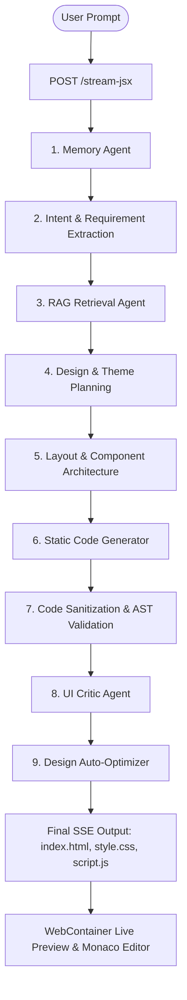

# ⚡ SynapseAI - Autonomous Multi-Agent AI Web Generator & Workspace

[](https://synapseai-ebon.vercel.app/)
[](https://fastapi.tiangolo.com/)
[](https://react.dev/)
[](https://tailwindcss.com/)
[](LICENSE)

> **SynapseAI** is an autonomous, multi-agent AI system that transforms natural language prompts into production-ready, fully responsive static websites and web applications in seconds. Powered by specialized collaborative AI agents, WebContainer sandbox preview, Monaco Editor, and real-time SSE streaming.

🌐 **Live Demo**: [https://synapseai-ebon.vercel.app/](https://synapseai-ebon.vercel.app/)

---

## 📌 Table of Contents

- [🌟 Key Features](#-key-features)
- [🤖 Multi-Agent Architecture](#-multi-agent-architecture)
- [🏗️ System Workflow](#️-system-workflow)
- [📁 Repository Structure](#-repository-structure)
- [⚙️ Core Pipeline Functions](#️-core-pipeline-functions)
- [🔌 API Reference](#-api-reference)
- [🛠️ Getting Started & Installation](#️-getting-started--installation)
- [⚙️ Environment Variables](#️-environment-variables)
- [📜 License](#-license)

---

## 🌟 Key Features

### 🤖 Autonomous Multi-Agent Orchestration
- **Phased AI Pipeline**: Coordinates dedicated AI agents for memory retrieval, intent understanding, design planning, theme palette selection, component layout architecture, code generation, sanitization, quality feedback, and optimization.
- **RAG Knowledge Retrieval**: Uses vector-based RAG agents to fetch visual design patterns, layout blueprints, and code best practices.
- **Personalized AI Memory Agent**: Tracks user design preferences, preferred typography, branding colors, and past choices across sessions.
- **Awwwards-Level UI Critic & Auto-Optimizer**: Evaluates visual hierarchy, color contrast, spatial balance, and accessibility, auto-triggering an optimization phase if scores fall below threshold.
- **AST & Code Auto-Fixer**: Built-in static validation, stack-based HTML validator, and syntax checkers to guarantee valid HTML5, CSS3, and JavaScript outputs without runtime errors.

### 🌐 Pure Static & Modern Web Code Generation
- **Zero-Dependency Clean Code**:
  - `index.html`: Semantic HTML5 structure, modern accessibility meta tags, and optimized layout sections.
  - `style.css`: Modern CSS3 using `:root` design tokens, CSS Flexbox/Grid, smooth gradients, glassmorphism, and responsive media queries.
  - `script.js`: Native Vanilla JavaScript DOM interactions (mobile navigation toggles, smooth scroll observers, interactive tabs, accordions, dynamic counters).

### 💻 Modern Web Workspace & Interactive Editor
- **WebContainer Sandbox Live Preview**: Embedded WebContainer runtime engine provides instant, isolated browser preview of generated code without server deployment overhead.
- **Monaco Code Editor**: Full-featured code editor with syntax highlighting, multi-file tab switching (`index.html`, `style.css`, `script.js`), line numbers, and live sync.
- **Real-Time SSE Timeline Streaming**: Streams live agent status events, timeline progress indicators, thinking steps, and final code payloads over Server-Sent Events.
- **Supabase Authentication**: Integrated Auth engine supporting secure User Login, Signup, Protected Routes, and User Profile management.
- **Project & Workspace Management**:
  - **Saved Projects**: Store, browse, and re-open generated designs.
  - **Favorites**: Bookmark top designs for quick access.
  - **Templates Gallery**: Pre-built prompt blueprints across categories (SaaS, E-commerce, Portfolio, Landing Pages, Dashboards).
  - **Recently Generated**: Timeline feed of past generations.
  - **Dark / Light Theme Support**: Sleek, customizable dark and light interface themes.

---

## 🤖 Multi-Agent Architecture

SynapseAI orchestrates specialized AI agents working together in a phased pipeline:

| Agent Name | Description |
| :--- | :--- |
| **🧠 Memory Agent** | Retrieves user design preferences, brand rules, typography preferences, and historical generation history. |
| **🎯 Router & Intent Agent** | Analyzes user prompts, extracts explicit and implicit requirements, target audience, and website category. |
| **🎨 Unified & Design Planner** | Plans color palettes, typography pairs, spacing systems, theme tokens, and component wireframe architecture. |
| **📚 RAG Retrieval Agent** | Searches internal design pattern library to retrieve standard UI blueprints and layout best practices. |
| **⚡ Component & Code Generator** | Translates structured design blueprints into semantic `index.html`, clean `style.css`, and interactive `script.js`. |
| **🛡️ Sanitizer & Auto-Fixer** | Strips formatting artifacts, normalizes line endings, performs AST/bracket validation, and auto-corrects syntax issues. |
| **🔍 UI Critic Agent** | Evaluates generated designs against modern UX benchmarks, visual balance, contrast ratios, and structural clarity. |
| **✨ Optimization Agent** | Refines and enhances HTML/CSS/JS based on critic feedback to deliver polished production quality. |

---

## 🏗️ System Workflow



---

## 📁 Repository Structure

```
.
├── backend/
│   ├── app/
│   │   ├── agents/            # Multi-Agent definitions (Memory, Router, Critic, Optimizer, Orchestrator)
│   │   ├── api/routes/        # FastAPI route definitions (/stream-jsx, /health, etc.)
│   │   ├── controllers/       # Route controllers & SSE streaming handlers
│   │   ├── core/              # System prompts & LLM model routing configurations
│   │   ├── pipeline/          # Core Pipeline Engine & multi-phase generation stages
│   │   ├── repositories/      # Vector DB & Memory storage services
│   │   └── utils/             # Code sanitizers, AST validators & error fixers
│   ├── main.py                # FastAPI server entrypoint
│   └── requirements.txt       # Backend Python dependencies
├── client/                    # Vite + React 19 Frontend Dashboard & Workspace
│   ├── src/
│   │   ├── components/        # UI components (Monaco CodePanel, WebContainer LivePreview, Hero, Features)
│   │   ├── context/           # AuthContext (Supabase) & ThemeContext
│   │   ├── hooks/             # Custom SSE generation hooks & WebContainer integrations
│   │   └── pages/             # App pages (Landing, Home, Templates, SavedProjects, Profile, Settings)
│   └── package.json           # Client package configurations
├── Makefile                   # Build & development task runner
├── make.bat                   # Native Windows Batch task wrapper
└── README.md                  # System documentation
```

---

## ⚙️ Core Pipeline Functions

### 1. Orchestration & Pipeline Engine

| Function / Class | Location | Description |
| :--- | :--- | :--- |
| `run_adk_orchestration_stream()` | [adk_orchestrator.py](file:///c:/merged_partition_content/D%20drive/Projects/text%20to%20design%20project/test-to-design3/backend/app/agents/adk/adk_orchestrator.py) | Main multi-agent execution loop. Coordinates timeline events, memory, generation, validation, critic, and final payload streaming. |
| `PipelineEngine.process_prompt()` | [engine.py](file:///c:/merged_partition_content/D%20drive/Projects/text%20to%20design%20project/test-to-design3/backend/app/pipeline/engine.py) | Executes Phases 1–4 (Intent Detection, Design Planning, Layout Architecture, Code Generation). |
| `StaticWebsiteGenerator.process()` | [code_generation.py](file:///c:/merged_partition_content/D%20drive/Projects/text%20to%20design%20project/test-to-design3/backend/app/pipeline/stages/code_generation.py) | Translates design blueprints into semantic `index.html`, `style.css`, and `script.js`. |

### 2. Validation, Sanitization & Repair

| Function / Class | Location | Description |
| :--- | :--- | :--- |
| `dry_run_compile()` | [project_runner.py](file:///c:/merged_partition_content/D%20drive/Projects/text%20to%20design%20project/test-to-design3/backend/project_runner.py) | Runs pre-flight static code validation on proposed files before returning them. |
| `validate_generated_code()` | [jsx_validator.py](file:///c:/merged_partition_content/D%20drive/Projects/text%20to%20design%20project/test-to-design3/backend/app/utils/validators/jsx_validator.py) | Stack-based bracket and HTML structure validator. |
| `run_code_sanitization()` | [sanitizer_agent.py](file:///c:/merged_partition_content/D%20drive/Projects/text%20to%20design%20project/test-to-design3/backend/app/agents/sanitizer_agent.py) | Cleans LLM output artifacts, strips markdown code blocks, and normalizes formatting. |

### 3. Review & Optimization

| Function / Class | Location | Description |
| :--- | :--- | :--- |
| `run_critic_agent()` | [critic_optimizer_agent.py](file:///c:/merged_partition_content/D%20drive/Projects/text%20to%20design%20project/test-to-design3/backend/app/agents/critic_optimizer_agent.py) | Evaluates generated design against UX benchmarks and scores quality (0–10). |
| `run_optimization_agent()` | [critic_optimizer_agent.py](file:///c:/merged_partition_content/D%20drive/Projects/text%20to%20design%20project/test-to-design3/backend/app/agents/critic_optimizer_agent.py) | Applies visual and functional improvements based on Critic feedback. |

---

## 🔌 API Reference

### `POST /stream-jsx`
Triggers the multi-agent design generation pipeline and streams SSE progress.

**Request Body:**
```json
{
  "prompt": "Build a modern SaaS landing page for an AI image generator",
  "user_id": "user_123"
}
```

**Response (Server-Sent Events Stream):**
```text
data: {"type": "session_created", "session_id": "session_1784701794"}
data: {"type": "timeline", "step": "Analyzing Prompt"}
data: {"type": "agent_start", "agent": "memory", "message": "Loading personalized profile..."}
...
data: {"type": "final_code", "data": {"success": true, "files": {"index.html": "...", "style.css": "...", "script.js": "..."}, "errors": [], "warnings": []}}
data: [DONE]
```

### `GET /health`
Returns system status.

```json
{
  "status": "ok"
}
```

---

## 🛠️ Getting Started & Installation

### Prerequisites
- **Node.js**: v18.0.0 or higher
- **Python**: v3.11 or higher
- **npm** or **pnpm**

### Quick Setup

1. **Clone the repository:**
   ```bash
   git clone https://github.com/premwizard/Text-to-Design.git
   cd Text-to-Design
   ```

2. **Install all dependencies (Frontend + Backend):**
   ```bash
   make install
   # Or on Windows using make.bat:
   make.bat install
   ```

3. **Start Development Servers:**
   - Launch FastAPI backend (runs on `http://127.0.0.1:8000`):
     ```bash
     make dev-backend
     ```
   - Launch Vite frontend client (runs on `http://localhost:5173`):
     ```bash
     make dev-client
     ```

4. **Production Build:**
   ```bash
   make build
   ```

---

## ⚙️ Environment Variables

The system supports dedicated **Development** and **Production** configurations:

### Backend Environment (`.env.development` / `.env.production`)
```env
ENVIRONMENT=development
DEBUG=true
ALLOWED_ORIGINS=http://localhost:5173
OPENAI_API_KEY=your_openai_api_key
GEMINI_API_KEY=your_gemini_api_key
```

### Client Environment (`client/.env.development` / `client/.env.production`)
```env
VITE_ENV=development
VITE_API_BASE_URL=http://127.0.0.1:8000
VITE_SUPABASE_URL=your_supabase_url
VITE_SUPABASE_ANON_KEY=your_supabase_anon_key
```

---

## 📜 License

Distributed under the MIT License. See [LICENSE](file:///c:/merged_partition_content/D%20drive/Projects/text%20to%20design%20project/test-to-design3/LICENSE) for more details.

---

<p align="center">
  Developed with ❤️ by the <b>SynapseAI Team</b> • <a href="https://synapseai-ebon.vercel.app/">Try Live Demo</a>
</p>
